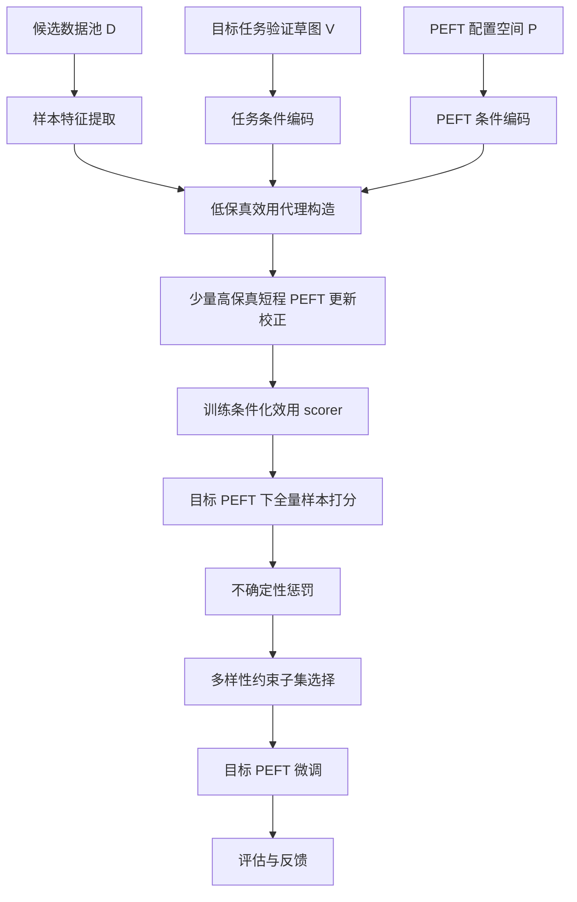

# 跨 PEFT 泛用的数据高效微调算法方案设计

> 工作名：**PCU-Select: PEFT-Conditional Utility Selection**  
> 当前版本定位：**面向稳定 PEFT 子空间的、任务条件化的、可复用多保真数据效用学习框架**  
> 适用目标：在多种 PEFT 配置反复比较或部署的场景中，降低重复数据价值估计成本，并提升目标 PEFT 下的数据选择质量。

---

## 0. 一句话概括

本课题研究的问题不是“哪些训练样本普遍高质量”，而是：

> 给定目标任务、目标 PEFT 配置和候选数据池，如何低成本预测每个样本在该 PEFT 子空间下的边际微调价值，并选择一个高效、覆盖性好的训练子集。

核心方法是学习一个条件化效用函数：

\[
s_\phi(x,p,t)
\]

其中：

- \(x\)：候选训练样本；
- \(p\)：目标 PEFT 配置；
- \(t\)：目标任务草图，由小型 validation sketch 编码得到；
- \(s_\phi(x,p,t)\)：样本 \(x\) 在任务 \(t\)、PEFT 配置 \(p\) 下的预测效用。

最终目标是用一次离线训练得到的 scorer，在后续不同 PEFT 配置下复用，从而避免每次都重新计算昂贵的梯度、影响函数或短程更新信号。

---

## 1. 研究目标与关键前提

### 1.1 严谨问题定义

给定：

- 固定 backbone family \(\mathcal{M}\)；
- 候选训练数据池 \(D=\{x_i\}_{i=1}^{N}\)；
- 目标任务的小型验证草图 \(V\)，编码为任务条件 \(t\)；
- 目标 PEFT 配置 \(p \in \mathcal{P}\)；
- 数据预算 \(B\)，例如选择 5%、10%、30% 数据；

目标是选择子集：

\[
S_B \subset D, \quad |S_B|\le B
\]

使得目标模型经过 PEFT 微调后，在目标任务上的表现最大化：

\[
S_B^\* = \arg\max_{S_B \subset D, |S_B|\le B}
\text{Perf}\big(\text{Tune}(M_0,p,S_B), V_{\text{test}}\big)
\]

由于直接枚举或逐样本真实训练代价过高，本课题转而学习一个近似效用函数：

\[
s_\phi(x,p,t) \approx u(x,p,t)
\]

并通过该函数对全量样本进行低成本打分与筛选。

---

### 1.2 关键前提

本课题成立依赖以下前提。

#### 前提 1：同一样本在不同 PEFT 下的价值并不相同

不同 PEFT 方法本质上限制了模型可更新的参数子空间或隐藏状态干预位置。例如：

- LoRA：在特定线性层上引入低秩增量；
- IA3：对中间激活进行乘性缩放；
- Adapter：插入瓶颈模块；
- Prefix/Prompt 类方法：通过可训练前缀或软提示影响模型状态。

因此，同一个样本可能对 LoRA 有价值，但对 IA3 或 Adapter 的贡献较弱。

#### 前提 2：PEFT 差异可以被结构化描述

PEFT 不是简单的 family 名字，而应被描述为：

- 改哪些层；
- 改哪些模块；
- 增量如何生成；
- 更新容量多大；
- 学习率、初始化、warmup、optimizer 等训练配方如何设置；
- 资源开销是多少。

这些结构化信息可以编码成条件向量 \(z_p\)。

#### 前提 3：样本价值必须相对目标任务定义

没有任务条件时，“数据价值”容易退化为普适质量分数。  
因此本方案引入 validation sketch \(V\)，编码目标任务条件 \(t\)。

#### 前提 4：离线元训练成本必须能被摊薄

本课题不是声称“所有阶段都很便宜”，而是强调：

- 第一阶段：离线构造监督信号和训练 scorer，成本较高；
- 第二阶段：应用到新 PEFT 时，只需前向特征提取 + scorer 打分，成本较低。

因此，该方法最适合多 PEFT、多配置、多轮实验复用的场景。

---

## 2. 当前方案的主要风险与设计原则

### 2.1 主要风险

| 模块 | 风险 | 为什么会被质疑 |
|---|---|---|
| 研究范围 | 声称跨所有 PEFT 泛化 | 实验无法覆盖，Prompt/Prefix 类方法不稳定，公平调参困难 |
| 效用标签 | 对大量 \((x,p)\) 做真实短程更新 | 成本可能高于直接运行 PEFT-specific selector |
| 样本表示 | 只用语义 embedding | 无法刻画样本作用于哪些层/模块 |
| PEFT 表示 | 只用 family one-hot | 无法反映 placement、rank、lr、warmup 等关键差异 |
| 任务条件 | 不输入目标任务草图 | 学到的是通用质量分，而不是任务相关效用 |
| 训练目标 | 只做绝对值回归 | 不同 PEFT 的效用量纲不同，回归不稳定 |
| 数据选择 | 直接 global top-k | 可能选出语义高度冗余的数据 |
| 成本分析 | 只报性能，不报 GPU-hours | 审稿人会质疑收益是否抵消离线成本 |
| 泛化主张 | 直接 zero-shot 跨 family | 缺少理论和实验证据支撑 |

---

### 2.2 设计原则

为降低上述风险，当前方案遵循以下原则：

1. **收缩主张**  
   主论文聚焦固定 backbone family 与稳定 PEFT 子空间，不承诺跨所有 PEFT 和所有模型 family。

2. **引入任务草图**  
   使用 validation sketch 明确目标任务，使效用定义闭环。

3. **多保真效用建模**  
   不直接对所有 \((x,p)\) 做真实短程更新，而是用低保真代理大规模覆盖，再用少量高保真标签校正。

4. **PEFT 条件表示必须完整**  
   不能只编码 PEFT family，还要编码 site mask、容量、训练配方和可选功能指纹。

5. **部署阶段必须低成本**  
   应用到新 PEFT 时，主要开销应接近 forward-only selection。

6. **实验必须 compute-aware**  
   不只比较最终性能，还要报告选择成本、总成本、break-even 使用次数。

---

## 3. 方法总览

### 3.1 整体流程

---

### 3.2 两阶段视角

#### 第一阶段：离线元训练阶段

目标：训练一个可复用的条件化效用预测器。

包括：

1. 定义 PEFT 配置空间；
2. 构造样本表示；
3. 构造任务表示；
4. 构造 PEFT 表示；
5. 构造低保真效用代理；
6. 对少量三元组计算高保真真实效用；
7. 训练 scorer。

#### 第二阶段：在线应用阶段

目标：给定一个目标 PEFT 和目标任务，低成本筛选数据。

包括：

1. 输入目标 PEFT 配置；
2. 输入目标 validation sketch；
3. 对全量数据提取或读取缓存特征；
4. scorer 打分；
5. 多样性约束选择；
6. 用选出的数据进行目标 PEFT 微调。

---

## 4. 样本表示设计

### 4.1 当前不推荐的简单方案

不推荐只使用单一语义 embedding：

\[
z_x = e_x
\]

问题：

- 只能表示“样本语义是什么”；
- 无法表示“样本对模型哪些层/模块产生影响”；
- 难以学习样本与 PEFT site mask 的交互；
- 容易退化为普通 embedding-based selection。

---

### 4.2 推荐样本表示

推荐将样本表示设计为：

\[
z_x = [e_x; d_x; a_x]
\]

其中：

#### 1. 语义表示 \(e_x\)

建议包括：

- instruction embedding；
- response embedding；
- instruction-response joint embedding；
- 可选：source/domain embedding。

作用：

- 表示样本内容、任务类型、语义相似性。

#### 2. 难度与质量统计 \(d_x\)

建议包括：

- instruction 长度；
- response 长度；
- 当前模型上的 token-level loss；
- 平均 log probability；
- perplexity；
- entropy；
- 是否包含 Chain-of-Thought；
- 数据来源；
- 语言；
- 格式类型。

作用：

- 区分简单格式样本、困难推理样本、噪声样本和高价值能力样本。

#### 3. 分层激活签名 \(a_x\)

对若干代表层提取 forward-only 统计，例如：

- early/mid/late 层 hidden norm；
- MLP activation norm；
- attention entropy；
- attention output norm；
- token-level variance；
- residual stream norm。

作用：

- 粗略刻画样本主要激活模型哪些层段；
- 使 scorer 能学习“样本层级特征”和“PEFT 修改位置”的交互。

---

## 5. PEFT 条件表示设计

### 5.1 不推荐方案

不推荐只使用：

\[
z_p = \text{one-hot}(\text{PEFT family})
\]

问题：

- 无法区分 LoRA rank=8 和 rank=64；
- 无法区分 q_proj/v_proj/o_proj placement；
- 无法区分学习率、初始化、warmup 等训练配方；
- 容易把超参差异误当作 PEFT 方法差异。

---

### 5.2 推荐 PEFT 表示

推荐将 PEFT 表示设计为：

\[
z_p = [m_p; c_p; r_p; f_p]
\]

其中：

#### 1. Site mask \(m_p\)

描述 PEFT 修改哪些位置：

- layer mask：哪些层被修改；
- module mask：attention / MLP / q_proj / k_proj / v_proj / o_proj / up_proj / down_proj 等；
- direction mask：加性、乘性、前缀注入、bias-only 等。

#### 2. Capacity vector \(c_p\)

描述 PEFT 的容量与资源属性：

- trainable parameter count；
- trainable parameter ratio；
- LoRA rank；
- LoRA alpha；
- adapter bottleneck width；
- prefix length；
- 额外 FLOPs；
- 显存增量；
- 推理延迟增量；
- 是否影响 KV cache。

#### 3. Recipe vector \(r_p\)

描述训练配方：

- optimizer；
- learning rate；
- scheduler；
- warmup ratio；
- weight decay；
- dropout；
- batch size；
- initialization；
- gradient clipping；
- LoRA scaling 方式。

#### 4. Functional fingerprint \(f_p\)

可选但推荐。  
对固定 probe set 做一次轻量 profiling，得到 PEFT 的功能响应指纹，例如：

- 标准化短更新前后各层 hidden state 变化；
- logit KL 变化；
- probe loss 变化；
- 层级敏感性曲线；
- 不同 probe 类型上的响应差异。

作用：

- 弥补人工结构字段不够“物理”的问题；
- 帮助 scorer 理解 PEFT 在当前 backbone 上实际产生的功能扰动。

---

## 6. 任务条件表示设计

### 6.1 为什么必须引入任务条件

如果 scorer 只输入 \(x\) 和 \(p\)，则效用缺少参照系。  
一个样本是否有价值，取决于目标任务：

- 数学推理任务需要推理样本；
- 代码任务需要代码相关样本；
- 安全对齐任务需要安全偏好样本；
- 多语言任务需要目标语言覆盖。

因此推荐使用 validation sketch \(V\) 构造任务表示：

\[
z_t = f_t(V)
\]

---

### 6.2 任务草图构造

推荐每个任务使用 32–64 条 validation sketch 样本。

编码方式：

1. 对每条 validation 样本提取与训练样本相同的表示 \(z_x\)；
2. 使用 mean pooling、attention pooling 或 set encoder 得到任务向量；
3. 可选加入任务描述文本 embedding。

\[
z_t = \text{Pool}(\{z_v: v\in V\})
\]

注意：

- validation sketch 不能来自最终测试集；
- 必须在论文中清楚说明 sketch 构造协议；
- 可以做 sketch size 消融，例如 8 / 16 / 32 / 64 条。

---

## 7. 多保真效用定义

这是当前方案的核心。

### 7.1 为什么不直接全量真实短程更新

原始方案是对每个 \((x,p)\) 从当前模型出发进行 \(K\) 步 PEFT-only 更新，然后观察验证损失下降：

\[
\Delta(x,p) = \mathcal{L}_V(\theta) -
\mathcal{L}_V(\text{Adapt}_{p}^{K}(\theta,x))
\]

该想法直观，但存在明显问题：

1. 成本随 \((x,p)\) 对数量线性增长；
2. 若覆盖多个 PEFT，成本接近 \(N\times P\)；
3. 单 checkpoint、单 seed、单 horizon 标签噪声大；
4. 容易被质疑为何不直接用该真实效用排序；
5. 难以大规模部署。

因此推荐使用多保真策略。

---

### 7.2 低保真效用代理 \(u^{lo}\)

#### 核心思想

先在统一隐藏状态干预空间 \(\Omega\) 上计算样本和任务草图的局部梯度或响应签名，然后根据 PEFT 的 site mask 和容量权重组合得到 PEFT 条件代理效用。

定义干预 site 集合：

\[
\Omega = \{(l,m)\}
\]

其中 \(l\) 表示层，\(m\) 表示模块或隐藏状态位置。

对样本 \(x\) 和任务草图 \(t\)，计算：

\[
g_x^\omega = \text{Proj}(\nabla_{h^\omega}\ell(x))
\]

\[
g_t^\omega = \text{Proj}(\nabla_{h^\omega}\mathcal{L}_V)
\]

其中：

- \(h^\omega\)：site \(\omega\) 的隐藏状态；
- \(\text{Proj}\)：随机投影或低维压缩；
- \(g_x^\omega\)：样本在该 site 上的局部梯度签名；
- \(g_t^\omega\)：目标任务在该 site 上的局部梯度签名。

然后定义：

\[
u^{lo}(x,p,t)
=
\sum_{\omega\in\Omega}
\alpha_p^\omega \cdot
\cos(g_x^\omega, g_t^\omega)
\]

其中：

- \(\alpha_p^\omega\)：由 PEFT site mask、capacity、operator type 决定；
- 如果 PEFT 不作用于某 site，则该 site 权重为 0；
- 如果 PEFT 在某 site 容量更大，则该 site 权重更高。

#### 优点

- 样本梯度签名只需计算一次；
- 对多个 PEFT 可通过 mask 和权重复用；
- 避免对每个 PEFT 都单独做 backward 或 short-update；
- 低成本覆盖大量 \((x,p,t)\) 三元组。

#### 局限

- 仍是近似信号；
- 不能完全反映 optimizer、非线性训练动态和长程微调效果；
- 必须用高保真标签校正。

---

### 7.3 高保真真实效用 \(u^{hi}\)

对少量采样的 \((x,p,t)\) 三元组，计算真实短程 PEFT 更新效用。

定义：

\[
\Delta_{a,p,h}(x,t)
=
\mathcal{L}_V(\theta_a)
-
\mathcal{L}_V(\text{Adapt}^{h}_{p}(\theta_a,x))
\]

其中：

- \(\theta_a\)：第 \(a\) 个 anchor checkpoint；
- \(h\)：短程更新 horizon，例如 \(h\in\{1,4\}\)；
- \(\text{Adapt}^{h}_{p}\)：只更新 PEFT 参数，主模型冻结；
- \(V\)：目标任务 validation sketch。

为了降低噪声，不直接使用原始 \(\Delta\)，而是做组内归一化：

\[
\tilde{\Delta}_{a,p,h}(x,t)
=
\text{RankNorm}_{x}(\Delta_{a,p,h}(x,t))
\]

最终高保真效用定义为：

\[
u^{hi}(x,p,t)
=
\sum_{h\in\mathcal{H}} w_h
\cdot
\mathbb{E}_{a}
[
\tilde{\Delta}_{a,p,h}(x,t)
]
-
\beta \cdot
\text{Std}_{a}
[
\tilde{\Delta}_{a,p,h}(x,t)
]
\]

推荐默认设置：

- anchor 数 \(A=2\)；
- horizon \(\mathcal{H}=\{1,4\}\)；
- seed 默认 1 个；
- 只对高不确定区域额外补 seed；
- validation sketch 每任务 32–64 条。

---

### 7.4 高保真样本采样策略

高保真标签成本高，不能随机铺满。推荐三阶段采样。

#### 阶段 1：覆盖采样

按以下维度分层：

- 样本语义簇；
- 样本难度；
- 数据来源；
- 任务类型；
- PEFT family；
- PEFT placement；
- PEFT capacity；
- PEFT recipe。

目标是让初始高保真集合覆盖主要空间。

#### 阶段 2：不确定性采样

训练初始 scorer 后，优先选择：

\[
q_{\text{query}}(x,p,t)
=
\hat{\sigma}(x,p,t)
\cdot
(1+\gamma \cdot \text{ReLU}(\hat{u}^{lo}(x,p,t)))
\]

即：

- 不确定性高；
- 代理分数不低；
- 可能影响最终 top-k 排序的样本。

#### 阶段 3：边界样本补充

补充一些 scorer 判断错误或排序边界附近的样本，提升 top-k 区域排序质量。

---

## 8. Scorer 模型设计

### 8.1 输入

scorer 输入为：

\[
(z_x, z_p, z_t)
\]

其中：

- \(z_x\)：样本表示；
- \(z_p\)：PEFT 条件表示；
- \(z_t\)：任务条件表示。

---

### 8.2 模型结构

推荐使用轻量多塔结构：

\[
h_x = f_x(z_x)
\]

\[
h_p = f_p(z_p)
\]

\[
h_t = f_t(z_t)
\]

再进行条件融合：

\[
h =
[
h_x;
h_p;
h_t;
h_x \odot W_p h_p;
h_x \odot W_t h_t;
\text{Bilinear}(h_x,h_p)
]
\]

也可以用 FiLM 调制：

\[
\text{FiLM}(h_x|h_p,h_t)
=
\gamma(h_p,h_t)\odot h_x + \beta(h_p,h_t)
\]

---

### 8.3 输出

scorer 输出两个量：

\[
\hat{\mu}(x,p,t)
\]

\[
\hat{\sigma}(x,p,t)
\]

其中：

- \(\hat{\mu}\)：预测效用均值；
- \(\hat{\sigma}\)：预测不确定性。

部署时使用风险惩罚分数：

\[
q(x,p,t)
=
\hat{\mu}(x,p,t)
-
\lambda \hat{\sigma}(x,p,t)
\]

---

### 8.4 训练目标

推荐训练目标：

\[
\mathcal{L}
=
\lambda_1 \mathcal{L}_{rank}^{hi}
+
\lambda_2 \mathcal{L}_{reg}^{hi}
+
\lambda_3 \mathcal{L}_{proxy}^{lo}
+
\lambda_4 \mathcal{L}_{unc}
\]

#### 1. 高保真排序损失

在同一个 task-PEFT bucket 内做 pairwise ranking：

\[
\mathcal{L}_{rank}^{hi}
=
-\log \sigma
(
(\hat{\mu}_i-\hat{\mu}_j)
\cdot
\text{sign}(u_i^{hi}-u_j^{hi})
)
\]

作用：

- 直接优化最终选择所关心的排序；
- 避免跨 PEFT 绝对效用量纲不一致的问题。

#### 2. 高保真回归损失

\[
\mathcal{L}_{reg}^{hi}
=
\text{Huber}(\hat{\mu},u^{hi})
\]

作用：

- 保留效用强弱的绝对趋势。

#### 3. 低保真蒸馏损失

\[
\mathcal{L}_{proxy}^{lo}
=
\text{Huber}(\hat{\mu},u^{lo})
\]

作用：

- 利用大量低保真标签提供密集监督；
- 提高 scorer 在未覆盖区域的泛化能力。

#### 4. 不确定性建模损失

假设高保真效用服从：

\[
u^{hi} \sim \mathcal{N}(\hat{\mu},\hat{\sigma}^2)
\]

使用 heteroscedastic NLL：

\[
\mathcal{L}_{unc}
=
\frac{(u^{hi}-\hat{\mu})^2}{2\hat{\sigma}^2}
+
\frac{1}{2}\log \hat{\sigma}^2
\]

作用：

- 让模型知道哪些区域预测不可靠；
- 部署时用不确定性惩罚避免过度冒险。

---

## 9. 数据选择策略

### 9.1 不推荐：global top-k

直接按分数取 top-k：

\[
S = \text{TopK}_{x\in D}(q(x,p,t))
\]

问题：

- 可能选出高度相似样本；
- 对长尾任务覆盖不足；
- 容易牺牲数据多样性。

---

### 9.2 推荐：自适应聚类配额

#### 步骤

1. 在样本 embedding 空间对候选数据池聚类；
2. 对每个样本计算风险惩罚分数：

\[
q_i = \hat{\mu}_i - \lambda\hat{\sigma}_i
\]

3. 对每个簇 \(C_k\) 计算簇级价值：

\[
v_k = \text{MeanTopM}(\{q_i: x_i\in C_k\})
\]

4. 分配簇预算：

\[
b_k
=
B
\cdot
\frac{(v_k^+)^\alpha |C_k|^{1-\alpha}}
{\sum_j (v_j^+)^\alpha |C_j|^{1-\alpha}}
\]

其中：

- \(v_k^+=\max(v_k,0)\)；
- \(\alpha\) 控制“效用优先”与“覆盖优先”的平衡；
- \(\alpha=1\)：更偏向高分簇；
- \(\alpha=0\)：更偏向按簇大小覆盖。

5. 每个簇内选 top-\(b_k\) 样本；
6. 合并得到最终子集。

#### 优点

- 比 global top-k 更有覆盖性；
- 比复杂 DPP / submodular 方法更可扩展；
- 可解释性强；
- 易于做消融。

---

## 10. 训练与应用流程

### 10.1 离线训练流程

#### Step 0：定义支持空间

确定：

- backbone family；
- 任务集合；
- 候选数据池；
- PEFT 配置空间；
- validation sketch 构造方式；
- 预算比例。

#### Step 1：样本特征缓存

对 meta-pool 中样本进行一次前向，缓存：

- 语义 embedding；
- loss / perplexity / entropy；
- 层级激活签名；
- source/domain 元信息。

#### Step 2：PEFT 条件编码

对每个 PEFT 配置生成：

- site mask；
- capacity vector；
- recipe vector；
- optional functional fingerprint。

#### Step 3：低保真代理构造

在小 selector model 上计算：

- 样本 site-wise 梯度签名；
- 任务草图 site-wise 梯度签名；
- 根据 PEFT mask 聚合得到 \(u^{lo}\)。

#### Step 4：高保真标签生成

对采样出的少量 \((x,p,t)\)：

- 从共享 anchor checkpoint 出发；
- 进行 PEFT-only 短程更新；
- 在 validation sketch 上计算损失下降；
- 归一化并聚合得到 \(u^{hi}\)。

#### Step 5：训练 scorer

先用低保真标签预训练，再用高保真标签联合训练：

- ranking；
- regression；
- proxy distillation；
- uncertainty modeling。

#### Step 6：主动补点

根据 scorer 不确定性和低保真效用，选择部分三元组补充高保真标签，再继续训练。

---

### 10.2 应用流程

用户使用本方法时，只需要提供：

- 候选数据池；
- 目标 PEFT 配置；
- 目标任务 validation sketch；
- 数据预算。

具体步骤：

1. 系统检查目标 PEFT 是否在支持分布内；
2. 编码目标 PEFT 得到 \(z_{p^\*}\)；
3. 编码 validation sketch 得到 \(z_{t^\*}\)；
4. 对候选数据读取或提取样本特征 \(z_x\)；
5. scorer 输出 \(\hat{\mu}\) 与 \(\hat{\sigma}\)；
6. 计算风险惩罚分数；
7. 通过自适应聚类配额选择子集；
8. 用户使用该子集训练目标 PEFT；
9. 可将真实训练结果反馈给 scorer 做后续增量更新。

---

### 10.3 OOD 校准模式

如果目标 PEFT 不在训练支持分布内，例如：

- 新 PEFT family；
- 极端 rank；
- 极端 placement；
- 完全不同 recipe；
- 不同 backbone family；

则不建议直接 zero-shot 使用。

推荐启用校准模式：

1. 抽取 200–500 个样本；
2. 对目标 PEFT 计算少量高保真效用；
3. 冻结主 scorer，仅训练一个 calibration head；
4. 再对全量数据打分。

这使方法更现实，也更容易防御审稿质疑。

---

## 11. 成本与复杂度分析

### 11.1 成本分解

总成本分为离线成本和应用成本。

#### 离线成本

\[
C_{\text{offline}}
=
C_{\text{feat}}
+
C_{\text{lo}}
+
C_{\text{hi}}
+
C_{\text{scorer}}
\]

其中：

- \(C_{\text{feat}}\)：样本特征提取；
- \(C_{\text{lo}}\)：低保真代理构造；
- \(C_{\text{hi}}\)：高保真短程更新标签；
- \(C_{\text{scorer}}\)：scorer 训练。

#### 应用成本

\[
C_{\text{apply}}
=
C_{\text{feat-new}}
+
C_{\text{score}}
+
C_{\text{select}}
+
C_{\text{target-train}}
\]

其中：

- \(C_{\text{feat-new}}\)：目标数据池特征提取，可缓存；
- \(C_{\text{score}}\)：scorer 前向打分；
- \(C_{\text{select}}\)：聚类与选择；
- \(C_{\text{target-train}}\)：目标 PEFT 在子集上的训练成本。

---

### 11.2 离线成本估计

#### 样本特征提取

\[
C_{\text{feat}} = O(N_{\text{meta}}F_{\text{fwd}})
\]

其中 \(F_{\text{fwd}}\) 是一次前向代价。

#### 低保真代理

如果每个样本的 site-wise 梯度签名只计算一次：

\[
C_{\text{lo}} = O(N_{\text{meta}}G_{\text{small}})
\]

重点是：该项不应随 PEFT 数量 \(P\) 线性放大。  
不同 PEFT 通过 mask 和权重复用缓存的 site-wise 签名。

#### 高保真标签

\[
C_{\text{hi}}
=
O(Q_H \cdot A \cdot K_{\max} \cdot C_{\text{peft-step}})
\]

其中：

- \(Q_H\)：高保真三元组数量；
- \(A\)：anchor 数；
- \(K_{\max}\)：最大短程更新步数；
- \(C_{\text{peft-step}}\)：一次 PEFT-only 训练 step 成本。

推荐控制：

- \(Q_H = 5k\sim 10k\)；
- \(A=2\)；
- \(K_{\max}=4\)；
- validation sketch = 32–64。

#### Scorer 训练

一般远低于高保真标签成本。

---

### 11.3 应用成本估计

对于一个新目标 PEFT：

1. PEFT 编码：近似常数成本；
2. validation sketch 编码：很低；
3. 样本前向特征：\(O(NF_{\text{fwd}})\)，可缓存；
4. scorer 打分：\(O(NC_{\phi})\)，其中 \(C_{\phi}\ll F_{\text{fwd}}\)；
5. 聚类选择：\(O(N\log N)\) 或近似线性；
6. 目标训练：约为全量训练的 \(\alpha\) 倍，其中 \(\alpha=B/N\)。

---

### 11.4 Break-even 分析

本方法成立的关键是多次复用。

设：

- \(T\)：未来需要服务的目标 PEFT 数；
- \(C_{\text{specific}}\)：每个目标 PEFT 使用传统 PEFT-specific selector 的成本；
- \(C_{\text{apply}}\)：本方法每个目标 PEFT 的应用成本；
- \(C_{\text{offline}}\)：本方法离线元训练成本。

当满足：

\[
C_{\text{offline}} + T C_{\text{apply}}
<
T C_{\text{specific}}
\]

时，本方法在总成本上更划算。

等价地，break-even 使用次数为：

\[
T >
\frac{C_{\text{offline}}}
{C_{\text{specific}}-C_{\text{apply}}}
\]

论文中必须报告该曲线，否则容易被质疑离线成本无法摊薄。

---

## 12. 实验设计

### 12.1 主实验问题

主实验需要回答四个问题：

1. 本方法是否在目标 PEFT 上选出更有效的数据？
2. 本方法是否能跨 PEFT 配置复用？
3. 本方法是否比 PEFT-specific 方法更省总成本？
4. 每个关键模块是否真的有贡献？

---

### 12.2 数据集与任务建议

建议选择多个任务类型：

| 类型 | 示例任务 | 目的 |
|---|---|---|
| 通用指令 | AlpacaEval / MT-Bench 风格 | 测试 instruction following |
| 数学推理 | GSM8K / MATH 子集 | 测试推理样本选择 |
| 代码 | HumanEval / MBPP | 测试代码数据选择 |
| 知识问答 | MMLU / ARC / CommonsenseQA | 测试知识与常识 |
| 多语言 | TyDiQA / XNLI 子集 | 测试跨语言覆盖 |
| 安全对齐 | safety preference 子集 | 测试安全相关样本是否被保留 |

---

### 12.3 PEFT 配置空间

主实验建议使用稳定 PEFT 子空间：

- LoRA；
- IA3；
- Bottleneck Adapter。

LoRA 内部变化：

- rank：4 / 8 / 16 / 32；
- target modules：qv / qkvo / all linear；
- layer range：low / mid / high / all；
- learning rate：low / medium / high；
- alpha scaling。

Adapter 内部变化：

- bottleneck width；
- layer placement；
- residual scaling。

IA3 内部变化：

- attention-only；
- MLP-only；
- attention + MLP。

Prompt/Prefix/P-Tuning：

- 不建议作为主结论；
- 可作为 OOD 扩展实验或失败案例分析。

---

### 12.4 对比基线

必须包含以下基线。

#### 基础基线

- Random；
- Balanced Random；
- Length-based；
- Loss-based；
- Perplexity-based；
- IFD。

#### 表示类选择

- Embedding nearest to validation；
- RDS+；
- Diversity-only clustering。

#### 训练动态类选择

- LESS；
- Influence-style gradient similarity；
- S2L；
- 其他可运行的 PEFT-specific selector。

#### 本方法变体

- Low-fidelity only；
- High-fidelity only；
- 无 PEFT condition；
- 无 task condition；
- 无 uncertainty；
- global top-k；
- adaptive cluster selection。

---

### 12.5 评价指标

#### 性能指标

- Accuracy；
- Exact Match；
- F1；
- Pass@k；
- Win rate；
- Reward model score；
- Human / GPT-based evaluation。

#### 数据选择指标

在 held-out \((x,p,t)\) 对上评估：

- Spearman correlation；
- Kendall tau；
- NDCG@K；
- Top-K hit rate；
- Pairwise ranking accuracy。

#### 成本指标

必须报告：

- 离线 GPU-hours；
- 每个目标 PEFT 的应用 GPU-hours；
- 总 GPU-hours；
- 峰值显存；
- 持久化存储；
- 目标训练节省；
- break-even 使用次数。

#### 稳定性指标

- 不同 seed 方差；
- 不同 validation sketch 方差；
- 不同数据预算方差；
- 不同 PEFT 配置方差。

---

### 12.6 核心实验

#### 实验 1：单 PEFT 下的数据选择效果

设置：

- 固定任务；
- 固定目标 PEFT；
- 比较不同选择方法；
- 数据预算：5% / 10% / 30%。

目的：

- 验证本方法不是只在跨 PEFT 时有效，在单个 PEFT 下也有竞争力。

若结果不理想：

- 分析是否被简单 embedding baseline 超越；
- 检查 scorer 是否过度依赖语义相似；
- 检查高保真标签是否噪声过大。

---

#### 实验 2：跨 PEFT 复用效果

设置：

- 用部分 PEFT 配置训练 scorer；
- 在未见过的 PEFT 配置上测试；
- 包括 seen family unseen configuration，以及 unseen family。

目的：

- 验证 PEFT 条件化建模是否真的带来泛化。

若结果不理想：

- 区分 ID 配置失败还是 OOD family 失败；
- 若 OOD 失败，可把 zero-shot 改为 calibration mode；
- 若 ID 失败，说明 PEFT 表示或训练标签不足。

---

#### 实验 3：多 PEFT 总成本对比

设置：

- 模拟未来要服务 \(T=1,3,5,10\) 个目标 PEFT；
- 比较传统 per-PEFT selector 与本方法；
- 画总 GPU-hours 曲线。

目的：

- 证明本方法的 amortization 逻辑成立。

若结果不理想：

- 说明离线成本过高；
- 需要减少 \(Q_H\)、anchor 数或高保真 horizon；
- 或将主张改为“性能优先”而非“成本优先”。

---

#### 实验 4：多保真标签有效性

比较：

- 仅低保真；
- 仅高保真；
- 低保真 + 高保真；
- 不同高保真预算。

目的：

- 证明多保真设计不是多余复杂度。

若结果不理想：

- 如果 low-only 已足够，说明高保真可改为可选；
- 如果 high-only 更好但成本大，需强调性能/成本 trade-off；
- 如果二者结合无提升，说明融合损失或标签定义需要调整。

---

#### 实验 5：条件表示消融

比较：

- family one-hot；
- + site mask；
- + capacity；
- + recipe；
- + functional fingerprint。

目的：

- 证明 PEFT 表示不是简单 one-hot 拼接。

若结果不理想：

- 如果 recipe 不提升，可能训练配置控制得过窄；
- 如果 fingerprint 不提升，可将其降级为可选模块；
- 如果 site mask 不提升，说明样本层级表示不足。

---

#### 实验 6：任务草图消融

比较：

- 无 task condition；
- 8 条 sketch；
- 16 条 sketch；
- 32 条 sketch；
- 64 条 sketch。

目的：

- 证明任务条件对数据价值定义是必要的；
- 找到成本与稳定性的平衡点。

---

#### 实验 7：选择策略消融

比较：

- global top-k；
- uniform cluster top-k；
- adaptive cluster budget；
- DPP / submodular greedy 可选。

目的：

- 验证多样性约束是否有必要；
- 证明 adaptive cluster 在性能与成本之间更平衡。

---

## 13. 预期贡献点

建议将论文贡献写成三个独立贡献。

### 贡献 1：PEFT 条件化数据效用建模

提出将数据选择从 task-only 或 model-only 扩展到 PEFT-conditional setting：

\[
s_\phi(x,p,t)
\]

显式建模样本价值如何随 PEFT 子空间变化。

### 贡献 2：统一隐藏状态干预空间下的多保真效用学习

提出：

- 低保真 site-wise proxy；
- 少量高保真真实短程 PEFT 更新；
- 两者联合训练 scorer。

解决跨 PEFT 场景中重复计算昂贵信号的问题。

### 贡献 3：可部署的低成本跨 PEFT 数据筛选流程

训练完成后，对新 PEFT 的应用成本接近 forward-only selection，并支持：

- 全量打分；
- 不确定性惩罚；
- 多样性约束；
- OOD 校准。

---

## 14. 与已有方法的区别

### 14.1 相比普通 embedding / RDS+ 方法

普通表示类方法主要衡量样本与目标任务的语义相似性。  
本方法额外考虑：

- PEFT 修改的子空间；
- 样本对不同层/模块的作用；
- 目标 PEFT 的训练配方与容量。

### 14.2 相比 LESS / influence-style 方法

LESS 等方法通常针对特定训练配置计算梯度或影响信号。  
本方法尝试将这类信号蒸馏到 PEFT-conditioned scorer 中，使其在多个 PEFT 配置间复用。

### 14.3 相比 NN-CIFT 类 learned proxy

NN-CIFT 证明小网络可学习昂贵 influence proxy。  
本方法的区别是：

- 引入 PEFT 条件；
- 引入任务草图；
- 引入多保真标签；
- 目标是跨 PEFT 复用，而非单一配置加速。

---

## 15. 审稿人可能质疑与应对

### 15.1 质疑：这是不是只是 LESS 加 PEFT 向量？

应对：

- 强调统一隐藏状态干预空间；
- 强调低保真代理可以跨 PEFT 复用；
- 强调少量高保真短程更新用于校正；
- 做去掉 PEFT condition 的消融。

---

### 15.2 质疑：离线成本是否过高？

应对：

- 报告完整 GPU-hours；
- 给出 break-even 曲线；
- 限制高保真预算；
- 展示多个目标 PEFT 下的摊薄优势；
- 与 per-PEFT selector 做总成本对比。

---

### 15.3 质疑：为什么不直接用简单 RDS+？

应对：

- 做 compute-controlled 对比；
- 展示在多 PEFT 复用场景中，本方法总成本更低或性能更强；
- 分析哪些任务/PEFT 下简单方法足够，主动给出边界。

---

### 15.4 质疑：PEFT 比较是否公平？

应对：

- 对各 PEFT 做合理超参搜索；
- 报告每个 PEFT 的最终 recipe；
- 在 PEFT 表示中纳入 recipe；
- 避免声称“某个 PEFT 方法绝对更好”。

---

### 15.5 质疑：泛化边界不清楚

应对：

- 主结论限定在 fixed backbone family；
- OOD family 只作为附加实验；
- 对未见 PEFT 提供 calibration mode；
- 明确列出失败案例。

---

### 15.6 质疑：任务草图是否数据泄漏？

应对：

- validation sketch 与 test set 严格隔离；
- 明确 sketch 构造协议；
- 对 sketch size 和随机抽样做稳定性实验。

---

### 15.7 质疑：方法模块太多，贡献不清晰

应对：

- 贡献只聚焦三点：PEFT-conditioned utility、多保真效用学习、可部署低成本选择；
- 其他模块作为必要工程组件；
- 每个模块都做消融，证明不是随意堆叠。

---

## 16. 适用场景与边界

### 16.1 适用场景

本方法适用于：

1. 同一数据池下需要比较多个 PEFT 配置；
2. AutoPEFT / PEFT search；
3. 工业微调平台；
4. 多任务或任务族微调；
5. 预算有限但需要多轮实验的场景；
6. 希望复用数据选择信号的研究或工程系统。

### 16.2 不适用场景

本方法不适合：

1. 只训练一次单一 PEFT；
2. 数据池很小且冗余低；
3. 没有 validation sketch；
4. 目标 PEFT 与训练支持空间差异极大且不愿校准；
5. 无法承担离线元训练成本；
6. 对安全、偏见、隐私要求极高但没有单独约束的数据选择场景。

---

## 17. 当前最推荐的默认配置

| 项目 | 推荐设置 |
|---|---|
| Backbone 范围 | 固定 family，同 family 不同尺寸 |
| 主 PEFT 空间 | LoRA / IA3 / Bottleneck Adapter |
| Prompt/Prefix | 作为 OOD 或附加实验 |
| Validation sketch | 每任务 32–64 条 |
| 样本表示 | 语义 + 难度统计 + 分层激活 |
| PEFT 表示 | site mask + capacity + recipe + optional fingerprint |
| Anchor 数 | 2 |
| Horizon | \(\{1,4\}\) |
| 高保真 pair 数 | 5k–10k 起步 |
| 低保真代理 | site-wise gradient / response proxy |
| Scorer 目标 | ranking + regression + proxy distillation + uncertainty |
| 选择策略 | adaptive cluster budget |
| OOD 策略 | 200–500 pair calibration |

---

## 18. 建议保留、修改、删除与重构

### 18.1 建议保留

- 跨 PEFT 数据选择的核心动机；
- PEFT 条件化效用建模；
- PEFT 作为隐藏状态扰动的视角；
- 第二阶段低成本全量打分；
- 多样性约束筛选。

### 18.2 建议修改

- 将“跨所有 PEFT”改为“稳定 PEFT 子空间”；
- 将“样本 + PEFT”改为“样本 + PEFT + 任务草图”；
- 将 PEFT one-hot 改为结构化配置编码；
- 将单次真实效用改为多保真效用；
- 将纯回归改为排序为主、回归为辅；
- 将 global top-k 改为自适应聚类配额。

### 18.3 建议删除

- 单 checkpoint、单 horizon、单 seed 的效用真值；
- 对全量 \(N\times P\) 做真实短程更新；
- 直接承诺跨 backbone family zero-shot；
- 主实验覆盖不稳定 prompt 类 PEFT 的强主张。

### 18.4 建议大幅重构

最需要重构的是第一阶段效用建模。

原始方案：

> 对样本和 PEFT 做真实短程更新，得到效用标签，再训练 scorer。

推荐方案：

> 统一隐藏状态干预空间低保真代理  
> + 少量真实 PEFT 短程更新高保真校正  
> + 任务条件化 scorer 蒸馏。

这样可以显著降低成本风险，并增强方法逻辑闭环。

---

## 19. 后续待完成工作清单

### 19.1 方法实现层面

- [ ] 定义 PEFT 配置 schema；
- [ ] 实现 PEFT site mask 生成；
- [ ] 实现样本 forward 特征缓存；
- [ ] 实现 validation sketch 编码；
- [ ] 实现低保真 site-wise proxy；
- [ ] 实现高保真短程 PEFT 更新脚本；
- [ ] 实现 scorer 模型；
- [ ] 实现 adaptive cluster selection；
- [ ] 实现 OOD calibration head。

### 19.2 实验层面

- [ ] 确定任务集合；
- [ ] 确定候选数据池；
- [ ] 确定主 PEFT 配置集合；
- [ ] 跑 random / RDS+ / PPL / IFD / LESS 基线；
- [ ] 跑单 PEFT 数据选择实验；
- [ ] 跑跨 PEFT 泛化实验；
- [ ] 跑成本曲线实验；
- [ ] 跑模块消融；
- [ ] 跑失败案例分析。

### 19.3 写作层面

- [ ] 明确主问题定义；
- [ ] 明确适用边界；
- [ ] 写出方法图；
- [ ] 写出复杂度分析；
- [ ] 写出 break-even 分析；
- [ ] 写出审稿质疑应对；
- [ ] 准备 ablation 表格模板；
- [ ] 准备 cost-performance 图模板。

---

## 20. 最终结论

当前课题方向有价值，但不能直接按“跨所有 PEFT 的万能数据选择器”来写。最稳妥、最能落地、也最容易通过审稿质疑的版本是：

> **面向固定 backbone family 和稳定 PEFT 子空间，学习一个任务条件化的 PEFT-aware 数据效用 scorer。通过统一隐藏状态干预空间构造低保真代理，用少量真实短程 PEFT 更新进行高保真校正，最终在部署阶段实现对目标 PEFT 的低成本全量打分与多样性约束筛选。**

这版方案的优点是：

- 动机成立；
- 问题定义更清晰；
- 成本结构可解释；
- 方法模块有独立贡献；
- 实验可以直接验证；
- 审稿人即使质疑，也有对应防御策略。

最关键的下一步不是继续扩展概念，而是尽快落地三个最小闭环实验：

1. **low-fidelity proxy 是否与真实短程 PEFT 效用相关**；
2. **加入 PEFT condition 是否优于不加 PEFT condition**；
3. **同等成本下，本方法是否优于 RDS+ / PPL / LESS 等基线**。

只要这三个实验成立，课题的主线就基本站住了。
