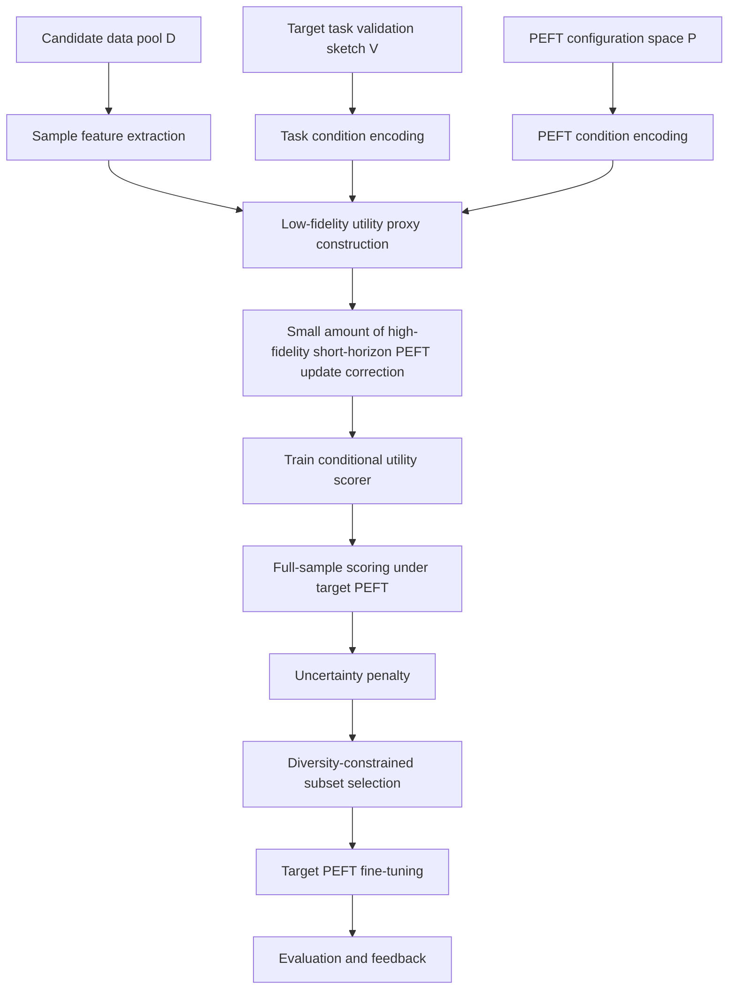

# Cross-PEFT General-Purpose Data-Efficient Fine-Tuning Algorithm Design

> Working name: **PCU-Select: PEFT-Conditional Utility Selection**
> Current version positioning: **A task-conditioned, reusable multi-fidelity data utility learning framework for stable PEFT subspaces**
> Target use: In scenarios where multiple PEFT configurations are repeatedly compared or deployed, reduce the cost of repeated data-value estimation and improve data selection quality under the target PEFT.

---

## 0. One-Sentence Summary

The problem studied in this project is not “which training samples are generally high quality,” but rather:

> Given a target task, a target PEFT configuration, and a candidate data pool, how can we predict at low cost the marginal fine-tuning value of each sample under that PEFT subspace, and select an efficient training subset with good coverage?

The core method is to learn a conditional utility function:

[
s_\phi(x,p,t)
]

where:

* (x): candidate training sample;
* (p): target PEFT configuration;
* (t): target task sketch, encoded from a small validation sketch;
* (s_\phi(x,p,t)): predicted utility of sample (x) under task (t) and PEFT configuration (p).

The final goal is to obtain a scorer through one round of offline training and reuse it across different downstream PEFT configurations, thereby avoiding the need to recompute expensive gradients, influence functions, or short-horizon update signals each time.

---

## 1. Research Objective and Key Assumptions

### 1.1 Rigorous Problem Definition

Given:

* a fixed backbone family (\mathcal{M});
* a candidate training data pool (D={x_i}_{i=1}^{N});
* a small validation sketch (V) for the target task, encoded as task condition (t);
* a target PEFT configuration (p \in \mathcal{P});
* a data budget (B), such as selecting 5%, 10%, or 30% of the data;

the goal is to select a subset:

[
S_B \subset D, \quad |S_B|\le B
]

such that after PEFT fine-tuning, the target model maximizes performance on the target task:

[
S_B^* = \arg\max_{S_B \subset D, |S_B|\le B}
\text{Perf}\big(\text{Tune}(M_0,p,S_B), V_{\text{test}}\big)
]

Since direct enumeration or per-sample true training is too costly, this project instead learns an approximate utility function:

[
s_\phi(x,p,t) \approx u(x,p,t)
]

and uses this function to score and filter the full set of samples at low cost.

---

### 1.2 Key Assumptions

This project relies on the following assumptions.

#### Assumption 1: The same sample does not have identical value under different PEFT methods

Different PEFT methods essentially constrain the model’s updatable parameter subspace or the intervention locations in hidden states. For example:

* LoRA: introduces low-rank increments on specific linear layers;
* IA3: applies multiplicative scaling to intermediate activations;
* Adapter: inserts bottleneck modules;
* Prefix/Prompt methods: influence model states through trainable prefixes or soft prompts.

Therefore, the same sample may be valuable for LoRA but contribute less to IA3 or Adapter.

#### Assumption 2: PEFT differences can be structurally described

PEFT should not be described merely by a family name, but by:

* which layers are modified;
* which modules are modified;
* how the increments are generated;
* how large the update capacity is;
* how the training recipe is configured, such as learning rate, initialization, warmup, and optimizer;
* what the resource cost is.

These structured pieces of information can be encoded into a condition vector (z_p).

#### Assumption 3: Sample value must be defined relative to the target task

Without task conditioning, “data value” easily degenerates into a universal quality score.
Therefore, this proposal introduces a validation sketch (V), which encodes the target task condition (t).

#### Assumption 4: Offline meta-training cost must be amortizable

This project does not claim that “all stages are cheap.” Instead, it emphasizes:

* Stage 1: offline construction of supervision signals and scorer training, with relatively high cost;
* Stage 2: when applying to a new PEFT, only forward feature extraction + scorer scoring is needed, with relatively low cost.

Therefore, this method is best suited for scenarios involving multiple PEFT methods, multiple configurations, and repeated experimental reuse.

---

## 2. Main Risks and Design Principles of the Current Proposal

### 2.1 Main Risks

| Module                | Risk                                                         | Why it may be questioned                                                                                   |
| --------------------- | ------------------------------------------------------------ | ---------------------------------------------------------------------------------------------------------- |
| Research scope        | Claiming generalization across all PEFT methods              | Experiments cannot cover this; Prompt/Prefix methods are unstable; fair hyperparameter tuning is difficult |
| Utility labels        | Performing true short-horizon updates for many ((x,p)) pairs | The cost may exceed directly running a PEFT-specific selector                                              |
| Sample representation | Using only semantic embeddings                               | Cannot characterize which layers/modules a sample affects                                                  |
| PEFT representation   | Using only family one-hot                                    | Cannot reflect key differences such as placement, rank, lr, and warmup                                     |
| Task condition        | Not inputting a target task sketch                           | What is learned is a general quality score, not task-relevant utility                                      |
| Training objective    | Only doing absolute-value regression                         | Utilities under different PEFT methods have different scales, making regression unstable                   |
| Data selection        | Direct global top-k                                          | May select semantically highly redundant data                                                              |
| Cost analysis         | Reporting only performance, not GPU-hours                    | Reviewers will question whether the benefits offset the offline cost                                       |
| Generalization claim  | Direct zero-shot transfer across families                    | Lacks theoretical and experimental support                                                                 |

---

### 2.2 Design Principles

To reduce the above risks, the current proposal follows these principles:

1. **Narrow the claim**
   The main paper focuses on a fixed backbone family and a stable PEFT subspace, without promising transfer across all PEFT methods and all model families.

2. **Introduce a task sketch**
   Use a validation sketch to explicitly specify the target task and close the loop of utility definition.

3. **Multi-fidelity utility modeling**
   Instead of performing true short-horizon updates for all ((x,p)) pairs, use a low-fidelity proxy for large-scale coverage and a small amount of high-fidelity labels for correction.

4. **PEFT condition representation must be complete**
   Do not encode only the PEFT family; also encode the site mask, capacity, training recipe, and optional functional fingerprint.

5. **The deployment stage must be low-cost**
   When applying to a new PEFT, the main cost should be close to forward-only selection.

6. **Experiments must be compute-aware**
   Compare not only final performance, but also selection cost, total cost, and break-even usage count.

---

## 3. Method Overview

### 3.1 Overall Pipeline

---

### 3.2 Two-Stage Perspective

#### Stage 1: Offline Meta-Training Stage

Goal: train a reusable conditional utility predictor.

Includes:

1. Define the PEFT configuration space;
2. Construct sample representations;
3. Construct task representations;
4. Construct PEFT representations;
5. Construct low-fidelity utility proxies;
6. Compute high-fidelity true utility for a small number of triples;
7. Train the scorer.

#### Stage 2: Online Application Stage

Goal: given a target PEFT and target task, select data at low cost.

Includes:

1. Input the target PEFT configuration;
2. Input the target validation sketch;
3. Extract or read cached features for the full data;
4. Score with the scorer;
5. Select with diversity constraints;
6. Fine-tune the target PEFT using the selected data.

---

## 4. Sample Representation Design

### 4.1 Simple Proposal Not Recommended

It is not recommended to use only a single semantic embedding:

[
z_x = e_x
]

Problems:

* It can only represent “what the sample semantics are”;
* It cannot represent “which layers/modules of the model the sample affects”;
* It is difficult to learn interactions between samples and the PEFT site mask;
* It can easily degenerate into ordinary embedding-based selection.

---

### 4.2 Recommended Sample Representation

It is recommended to design the sample representation as:

[
z_x = [e_x; d_x; a_x]
]

where:

#### 1. Semantic representation (e_x)

Recommended components include:

* instruction embedding;
* response embedding;
* instruction-response joint embedding;
* optional: source/domain embedding.

Purpose:

* Represent sample content, task type, and semantic similarity.

#### 2. Difficulty and quality statistics (d_x)

Recommended components include:

* instruction length;
* response length;
* token-level loss under the current model;
* average log probability;
* perplexity;
* entropy;
* whether Chain-of-Thought is included;
* data source;
* language;
* format type.

Purpose:

* Distinguish simple-format samples, difficult reasoning samples, noisy samples, and high-value capability samples.

#### 3. Hierarchical activation signature (a_x)

Extract forward-only statistics from several representative layers, such as:

* early/mid/late layer hidden norm;
* MLP activation norm;
* attention entropy;
* attention output norm;
* token-level variance;
* residual stream norm.

Purpose:

* Roughly characterize which layer segments of the model are mainly activated by the sample;
* Enable the scorer to learn interactions between “sample-level layer features” and “PEFT modification locations.”

---

## 5. PEFT Condition Representation Design

### 5.1 Proposal Not Recommended

It is not recommended to use only:

[
z_p = \text{one-hot}(\text{PEFT family})
]

Problems:

* Cannot distinguish LoRA rank=8 from rank=64;
* Cannot distinguish q_proj/v_proj/o_proj placement;
* Cannot distinguish training recipes such as learning rate, initialization, and warmup;
* Easily mistakes hyperparameter differences for PEFT-method differences.

---

### 5.2 Recommended PEFT Representation

It is recommended to design the PEFT representation as:

[
z_p = [m_p; c_p; r_p; f_p]
]

where:

#### 1. Site mask (m_p)

Describes which positions PEFT modifies:

* layer mask: which layers are modified;
* module mask: attention / MLP / q_proj / k_proj / v_proj / o_proj / up_proj / down_proj, etc.;
* direction mask: additive, multiplicative, prefix injection, bias-only, etc.

#### 2. Capacity vector (c_p)

Describes PEFT capacity and resource attributes:

* trainable parameter count;
* trainable parameter ratio;
* LoRA rank;
* LoRA alpha;
* adapter bottleneck width;
* prefix length;
* extra FLOPs;
* memory increment;
* inference latency increment;
* whether KV cache is affected.

#### 3. Recipe vector (r_p)

Describes the training recipe:

* optimizer;
* learning rate;
* scheduler;
* warmup ratio;
* weight decay;
* dropout;
* batch size;
* initialization;
* gradient clipping;
* LoRA scaling method.

#### 4. Functional fingerprint (f_p)

Optional but recommended.
Perform lightweight profiling on a fixed probe set to obtain the functional response fingerprint of the PEFT, such as:

* normalized hidden-state changes across layers before and after short updates;
* logit KL changes;
* probe loss changes;
* layer-wise sensitivity curves;
* response differences across different probe types.

Purpose:

* Compensate for the fact that manually designed structural fields are not sufficiently “physical”;
* Help the scorer understand the actual functional perturbation produced by the PEFT on the current backbone.

---

## 6. Task Condition Representation Design

### 6.1 Why Task Conditions Must Be Introduced

If the scorer only takes (x) and (p) as input, the utility lacks a reference frame.
Whether a sample is valuable depends on the target task:

* mathematical reasoning tasks need reasoning samples;
* code tasks need code-related samples;
* safety alignment tasks need safety preference samples;
* multilingual tasks need coverage of the target language.

Therefore, it is recommended to use a validation sketch (V) to construct the task representation:

[
z_t = f_t(V)
]

---

### 6.2 Task Sketch Construction

It is recommended to use 32–64 validation sketch samples for each task.

Encoding method:

1. Extract the same representation (z_x) as training samples for each validation sample;
2. Use mean pooling, attention pooling, or a set encoder to obtain the task vector;
3. Optionally add the embedding of the task description text.

[
z_t = \text{Pool}({z_v: v\in V})
]

Notes:

* The validation sketch must not come from the final test set;
* The paper must clearly describe the sketch construction protocol;
* Sketch size ablations can be performed, such as 8 / 16 / 32 / 64 samples.

---

## 7. Multi-Fidelity Utility Definition

This is the core of the current proposal.

### 7.1 Why Not Directly Perform Full True Short-Horizon Updates

The original idea is to perform (K) steps of PEFT-only updates from the current model for each ((x,p)), and then observe the validation loss decrease:

[
\Delta(x,p) = \mathcal{L}_V(\theta) -
\mathcal{L}*V(\text{Adapt}*{p}^{K}(\theta,x))
]

This idea is intuitive, but has clear problems:

1. The cost grows linearly with the number of ((x,p)) pairs;
2. If multiple PEFT methods are covered, the cost approaches (N\times P);
3. Labels from a single checkpoint, single seed, and single horizon are noisy;
4. It is easy to be questioned why the true utility is not directly used for ranking;
5. It is difficult to deploy at scale.

Therefore, a multi-fidelity strategy is recommended.

---

### 7.2 Low-Fidelity Utility Proxy (u^{lo})

#### Core Idea

First compute local gradient or response signatures of samples and task sketches in a unified hidden-state intervention space (\Omega), then combine them according to the PEFT site mask and capacity weights to obtain a PEFT-conditioned proxy utility.

Define the intervention site set:

[
\Omega = {(l,m)}
]

where (l) denotes the layer and (m) denotes the module or hidden-state location.

For sample (x) and task sketch (t), compute:

[
g_x^\omega = \text{Proj}(\nabla_{h^\omega}\ell(x))
]

[
g_t^\omega = \text{Proj}(\nabla_{h^\omega}\mathcal{L}_V)
]

where:

* (h^\omega): hidden state at site (\omega);
* (\text{Proj}): random projection or low-dimensional compression;
* (g_x^\omega): local gradient signature of the sample at this site;
* (g_t^\omega): local gradient signature of the target task at this site.

Then define:

[
u^{lo}(x,p,t)
=============

\sum_{\omega\in\Omega}
\alpha_p^\omega \cdot
\cos(g_x^\omega, g_t^\omega)
]

where:

* (\alpha_p^\omega): determined by the PEFT site mask, capacity, and operator type;
* if the PEFT does not act on a site, the weight of that site is 0;
* if the PEFT has larger capacity at a site, the weight of that site is higher.

#### Advantages

* The sample gradient signature only needs to be computed once;
* It can be reused across multiple PEFT methods through masks and weights;
* It avoids performing separate backward passes or short updates for every PEFT;
* It covers a large number of ((x,p,t)) triples at low cost.

#### Limitations

* It is still an approximate signal;
* It cannot fully reflect optimizer behavior, nonlinear training dynamics, and long-horizon fine-tuning effects;
* It must be corrected with high-fidelity labels.

---

### 7.3 High-Fidelity True Utility (u^{hi})

For a small number of sampled ((x,p,t)) triples, compute true short-horizon PEFT update utility.

Define:

[
\Delta_{a,p,h}(x,t)
===================

## \mathcal{L}_V(\theta_a)

\mathcal{L}*V(\text{Adapt}^{h}*{p}(\theta_a,x))
]

where:

* (\theta_a): the (a)-th anchor checkpoint;
* (h): short-horizon update horizon, such as (h\in{1,4});
* (\text{Adapt}^{h}_{p}): only updates PEFT parameters while the main model is frozen;
* (V): validation sketch of the target task.

To reduce noise, do not directly use the raw (\Delta); instead, perform within-group normalization:

[
\tilde{\Delta}_{a,p,h}(x,t)
===========================

\text{RankNorm}*{x}(\Delta*{a,p,h}(x,t))
]

The final high-fidelity utility is defined as:

[
u^{hi}(x,p,t)
=============

\sum_{h\in\mathcal{H}} w_h
\cdot
\mathbb{E}*{a}
[
\tilde{\Delta}*{a,p,h}(x,t)
]
-

\beta \cdot
\text{Std}*{a}
[
\tilde{\Delta}*{a,p,h}(x,t)
]
]

Recommended default settings:

* number of anchors (A=2);
* horizon (\mathcal{H}={1,4});
* default seed count is 1;
* add extra seeds only for high-uncertainty regions;
* validation sketch has 32–64 samples per task.

---

### 7.4 High-Fidelity Sample Sampling Strategy

High-fidelity labels are expensive and cannot be randomly spread across the whole space. A three-stage sampling strategy is recommended.

#### Stage 1: Coverage Sampling

Stratify by the following dimensions:

* sample semantic cluster;
* sample difficulty;
* data source;
* task type;
* PEFT family;
* PEFT placement;
* PEFT capacity;
* PEFT recipe.

The goal is to make the initial high-fidelity set cover the major space.

#### Stage 2: Uncertainty Sampling

After training the initial scorer, prioritize:

[
q_{\text{query}}(x,p,t)
=======================

\hat{\sigma}(x,p,t)
\cdot
(1+\gamma \cdot \text{ReLU}(\hat{u}^{lo}(x,p,t)))
]

That is:

* high uncertainty;
* non-low proxy score;
* samples likely to affect the final top-k ranking.

#### Stage 3: Boundary Sample Supplementation

Supplement samples that the scorer judges incorrectly or samples near ranking boundaries, improving ranking quality in the top-k region.

---

## 8. Scorer Model Design

### 8.1 Input

The scorer input is:

[
(z_x, z_p, z_t)
]

where:

* (z_x): sample representation;
* (z_p): PEFT condition representation;
* (z_t): task condition representation.

---

### 8.2 Model Architecture

A lightweight multi-tower architecture is recommended:

[
h_x = f_x(z_x)
]

[
h_p = f_p(z_p)
]

[
h_t = f_t(z_t)
]

Then perform conditional fusion:

[
h =
[
h_x;
h_p;
h_t;
h_x \odot W_p h_p;
h_x \odot W_t h_t;
\text{Bilinear}(h_x,h_p)
]
]

FiLM modulation can also be used:

[
\text{FiLM}(h_x|h_p,h_t)
========================

\gamma(h_p,h_t)\odot h_x + \beta(h_p,h_t)
]

---

### 8.3 Output

The scorer outputs two quantities:

[
\hat{\mu}(x,p,t)
]

[
\hat{\sigma}(x,p,t)
]

where:

* (\hat{\mu}): predicted utility mean;
* (\hat{\sigma}): predicted uncertainty.

During deployment, use the risk-penalized score:

[
q(x,p,t)
========

## \hat{\mu}(x,p,t)

\lambda \hat{\sigma}(x,p,t)
]

---

### 8.4 Training Objective

The recommended training objective is:

[
\mathcal{L}
===========

\lambda_1 \mathcal{L}*{rank}^{hi}
+
\lambda_2 \mathcal{L}*{reg}^{hi}
+
\lambda_3 \mathcal{L}*{proxy}^{lo}
+
\lambda_4 \mathcal{L}*{unc}
]

#### 1. High-Fidelity Ranking Loss

Perform pairwise ranking within the same task-PEFT bucket:

[
\mathcal{L}_{rank}^{hi}
=======================

-\log \sigma
(
(\hat{\mu}_i-\hat{\mu}_j)
\cdot
\text{sign}(u_i^{hi}-u_j^{hi})
)
]

Purpose:

* Directly optimize the ranking that final selection cares about;
* Avoid the problem of inconsistent absolute utility scales across PEFT methods.

#### 2. High-Fidelity Regression Loss

[
\mathcal{L}_{reg}^{hi}
======================

\text{Huber}(\hat{\mu},u^{hi})
]

Purpose:

* Preserve the absolute trend of utility strength.

#### 3. Low-Fidelity Distillation Loss

[
\mathcal{L}_{proxy}^{lo}
========================

\text{Huber}(\hat{\mu},u^{lo})
]

Purpose:

* Use a large number of low-fidelity labels to provide dense supervision;
* Improve scorer generalization in uncovered regions.

#### 4. Uncertainty Modeling Loss

Assume the high-fidelity utility follows:

[
u^{hi} \sim \mathcal{N}(\hat{\mu},\hat{\sigma}^2)
]

Use heteroscedastic NLL:

[
\mathcal{L}_{unc}
=================

\frac{(u^{hi}-\hat{\mu})^2}{2\hat{\sigma}^2}
+
\frac{1}{2}\log \hat{\sigma}^2
]

Purpose:

* Let the model know which regions are unreliable;
* Use uncertainty penalties during deployment to avoid excessive risk-taking.

---

## 9. Data Selection Strategy

### 9.1 Not Recommended: Global Top-k

Directly take top-k by score:

[
S = \text{TopK}_{x\in D}(q(x,p,t))
]

Problems:

* May select highly similar samples;
* Insufficient coverage of long-tail tasks;
* Easily sacrifices data diversity.

---

### 9.2 Recommended: Adaptive Cluster Quota

#### Steps

1. Cluster the candidate data pool in the sample embedding space;
2. Compute the risk-penalized score for each sample:

[
q_i = \hat{\mu}_i - \lambda\hat{\sigma}_i
]

3. Compute the cluster-level value for each cluster (C_k):

[
v_k = \text{MeanTopM}({q_i: x_i\in C_k})
]

4. Allocate the cluster budget:

[
b_k
===

B
\cdot
\frac{(v_k^+)^\alpha |C_k|^{1-\alpha}}
{\sum_j (v_j^+)^\alpha |C_j|^{1-\alpha}}
]

where:

* (v_k^+=\max(v_k,0));
* (\alpha) controls the balance between “utility priority” and “coverage priority”;
* (\alpha=1): more biased toward high-score clusters;
* (\alpha=0): more biased toward coverage according to cluster size.

5. Select top-(b_k) samples within each cluster;
6. Merge them to obtain the final subset.

#### Advantages

* Better coverage than global top-k;
* More scalable than complex DPP / submodular methods;
* Highly interpretable;
* Easy to ablate.

---

## 10. Training and Application Pipeline

### 10.1 Offline Training Pipeline

#### Step 0: Define the Support Space

Determine:

* backbone family;
* task set;
* candidate data pool;
* PEFT configuration space;
* validation sketch construction method;
* budget ratio.

#### Step 1: Sample Feature Caching

Run one forward pass over samples in the meta-pool and cache:

* semantic embeddings;
* loss / perplexity / entropy;
* hierarchical activation signatures;
* source/domain metadata.

#### Step 2: PEFT Condition Encoding

For each PEFT configuration, generate:

* site mask;
* capacity vector;
* recipe vector;
* optional functional fingerprint.

#### Step 3: Low-Fidelity Proxy Construction

On a small selector model, compute:

* sample site-wise gradient signatures;
* task sketch site-wise gradient signatures;
* aggregate according to the PEFT mask to obtain (u^{lo}).

#### Step 4: High-Fidelity Label Generation

For a small number of sampled ((x,p,t)):

* start from a shared anchor checkpoint;
* perform PEFT-only short-horizon updates;
* compute validation loss decrease on the validation sketch;
* normalize and aggregate to obtain (u^{hi}).

#### Step 5: Train the Scorer

First pretrain with low-fidelity labels, then jointly train with high-fidelity labels:

* ranking;
* regression;
* proxy distillation;
* uncertainty modeling.

#### Step 6: Active Supplementation

Based on scorer uncertainty and low-fidelity utility, select some triples to supplement high-fidelity labels and continue training.

---

### 10.2 Application Pipeline

When using this method, the user only needs to provide:

* candidate data pool;
* target PEFT configuration;
* target task validation sketch;
* data budget.

Specific steps:

1. The system checks whether the target PEFT is within the support distribution;
2. Encode the target PEFT to obtain (z_{p^*});
3. Encode the validation sketch to obtain (z_{t^*});
4. Read or extract sample features (z_x) for the candidate data;
5. The scorer outputs (\hat{\mu}) and (\hat{\sigma});
6. Compute the risk-penalized score;
7. Select a subset through adaptive cluster quotas;
8. The user trains the target PEFT using this subset;
9. The true training result can be fed back to the scorer for subsequent incremental updates.

---

### 10.3 OOD Calibration Mode

If the target PEFT is not within the training support distribution, such as:

* new PEFT family;
* extreme rank;
* extreme placement;
* completely different recipe;
* different backbone family;

then direct zero-shot use is not recommended.

Calibration mode is recommended:

1. Sample 200–500 samples;
2. Compute a small number of high-fidelity utilities for the target PEFT;
3. Freeze the main scorer and train only a calibration head;
4. Then score the full data.

This makes the method more realistic and easier to defend against reviewer criticism.

---

## 11. Cost and Complexity Analysis

### 11.1 Cost Decomposition

The total cost is divided into offline cost and application cost.

#### Offline Cost

[
C_{\text{offline}}
==================

C_{\text{feat}}
+
C_{\text{lo}}
+
C_{\text{hi}}
+
C_{\text{scorer}}
]

where:

* (C_{\text{feat}}): sample feature extraction;
* (C_{\text{lo}}): low-fidelity proxy construction;
* (C_{\text{hi}}): high-fidelity short-horizon update labels;
* (C_{\text{scorer}}): scorer training.

#### Application Cost

[
C_{\text{apply}}
================

C_{\text{feat-new}}
+
C_{\text{score}}
+
C_{\text{select}}
+
C_{\text{target-train}}
]

where:

* (C_{\text{feat-new}}): feature extraction for the target data pool, cacheable;
* (C_{\text{score}}): scorer forward scoring;
* (C_{\text{select}}): clustering and selection;
* (C_{\text{target-train}}): training cost of target PEFT on the subset.

---

### 11.2 Offline Cost Estimation

#### Sample Feature Extraction

[
C_{\text{feat}} = O(N_{\text{meta}}F_{\text{fwd}})
]

where (F_{\text{fwd}}) is the cost of one forward pass.

#### Low-Fidelity Proxy

If the site-wise gradient signature of each sample is computed only once:

[
C_{\text{lo}} = O(N_{\text{meta}}G_{\text{small}})
]

The key point is: this term should not grow linearly with the number of PEFT methods (P).
Different PEFT methods reuse cached site-wise signatures through masks and weights.

#### High-Fidelity Labels

[
C_{\text{hi}}
=============

O(Q_H \cdot A \cdot K_{\max} \cdot C_{\text{peft-step}})
]

where:

* (Q_H): number of high-fidelity triples;
* (A): number of anchors;
* (K_{\max}): maximum number of short-horizon update steps;
* (C_{\text{peft-step}}): cost of one PEFT-only training step.

Recommended control:

* (Q_H = 5k\sim 10k);
* (A=2);
* (K_{\max}=4);
* validation sketch = 32–64.

#### Scorer Training

Generally much lower than the cost of high-fidelity labels.

---

### 11.3 Application Cost Estimation

For a new target PEFT:

1. PEFT encoding: approximately constant cost;
2. validation sketch encoding: very low;
3. sample forward features: (O(NF_{\text{fwd}})), cacheable;
4. scorer scoring: (O(NC_{\phi})), where (C_{\phi}\ll F_{\text{fwd}});
5. clustering selection: (O(N\log N)) or approximately linear;
6. target training: approximately (\alpha) times full-data training, where (\alpha=B/N).

---

### 11.4 Break-even Analysis

The key to this method is reuse across multiple applications.

Let:

* (T): number of target PEFT methods to be served in the future;
* (C_{\text{specific}}): cost of using a traditional PEFT-specific selector for each target PEFT;
* (C_{\text{apply}}): application cost of this method for each target PEFT;
* (C_{\text{offline}}): offline meta-training cost of this method.

When:

[
C_{\text{offline}} + T C_{\text{apply}}
<
T C_{\text{specific}}
]

this method is more cost-effective in total cost.

Equivalently, the break-even usage count is:

[
T >
\frac{C_{\text{offline}}}
{C_{\text{specific}}-C_{\text{apply}}}
]

The paper must report this curve; otherwise, it is easy to be questioned that the offline cost cannot be amortized.

---

## 12. Experimental Design

### 12.1 Main Experimental Questions

The main experiments need to answer four questions:

1. Does this method select more effective data for the target PEFT?
2. Can this method be reused across PEFT configurations?
3. Is this method more cost-efficient in total cost than PEFT-specific methods?
4. Does each key module truly contribute?

---

### 12.2 Dataset and Task Suggestions

It is recommended to choose multiple task types:

| Type                   | Example Tasks               | Purpose                                          |
| ---------------------- | --------------------------- | ------------------------------------------------ |
| General instruction    | AlpacaEval / MT-Bench style | Test instruction following                       |
| Mathematical reasoning | GSM8K / MATH subset         | Test reasoning sample selection                  |
| Code                   | HumanEval / MBPP            | Test code data selection                         |
| Knowledge QA           | MMLU / ARC / CommonsenseQA  | Test knowledge and commonsense                   |
| Multilingual           | TyDiQA / XNLI subset        | Test cross-lingual coverage                      |
| Safety alignment       | safety preference subset    | Test whether safety-related samples are retained |

---

### 12.3 PEFT Configuration Space

The main experiments are recommended to use a stable PEFT subspace:

* LoRA;
* IA3;
* Bottleneck Adapter.

Internal LoRA variations:

* rank: 4 / 8 / 16 / 32;
* target modules: qv / qkvo / all linear;
* layer range: low / mid / high / all;
* learning rate: low / medium / high;
* alpha scaling.

Internal Adapter variations:

* bottleneck width;
* layer placement;
* residual scaling.

Internal IA3 variations:

* attention-only;
* MLP-only;
* attention + MLP.

Prompt/Prefix/P-Tuning:

* not recommended as main conclusions;
* can be used as OOD extension experiments or failure case analysis.

---

### 12.4 Comparison Baselines

The following baselines must be included.

#### Basic Baselines

* Random;
* Balanced Random;
* Length-based;
* Loss-based;
* Perplexity-based;
* IFD.

#### Representation-Based Selection

* Embedding nearest to validation;
* RDS+;
* Diversity-only clustering.

#### Training-Dynamics-Based Selection

* LESS;
* Influence-style gradient similarity;
* S2L;
* other runnable PEFT-specific selectors.

#### Variants of This Method

* Low-fidelity only;
* High-fidelity only;
* without PEFT condition;
* without task condition;
* without uncertainty;
* global top-k;
* adaptive cluster selection.

---

### 12.5 Evaluation Metrics

#### Performance Metrics

* Accuracy;
* Exact Match;
* F1;
* Pass@k;
* Win rate;
* Reward model score;
* Human / GPT-based evaluation.

#### Data Selection Metrics

Evaluate on held-out ((x,p,t)) pairs:

* Spearman correlation;
* Kendall tau;
* NDCG@K;
* Top-K hit rate;
* Pairwise ranking accuracy.

#### Cost Metrics

Must report:

* offline GPU-hours;
* application GPU-hours for each target PEFT;
* total GPU-hours;
* peak memory;
* persistent storage;
* target training savings;
* break-even usage count.

#### Stability Metrics

* variance across different seeds;
* variance across different validation sketches;
* variance across different data budgets;
* variance across different PEFT configurations.

---

### 12.6 Core Experiments

#### Experiment 1: Data Selection Effect under a Single PEFT

Setup:

* fixed task;
* fixed target PEFT;
* compare different selection methods;
* data budget: 5% / 10% / 30%.

Purpose:

* Verify that this method is not only effective in cross-PEFT settings, but also competitive under a single PEFT.

If the result is not ideal:

* Analyze whether it is surpassed by a simple embedding baseline;
* Check whether the scorer overly relies on semantic similarity;
* Check whether high-fidelity labels are too noisy.

---

#### Experiment 2: Cross-PEFT Reuse Effect

Setup:

* Train the scorer with some PEFT configurations;
* Test on unseen PEFT configurations;
* Include seen-family unseen-configuration and unseen-family settings.

Purpose:

* Verify whether PEFT-conditioned modeling truly brings generalization.

If the result is not ideal:

* Distinguish whether the failure is on ID configurations or OOD families;
* If OOD fails, change zero-shot to calibration mode;
* If ID fails, it indicates that PEFT representation or training labels are insufficient.

---

#### Experiment 3: Total Cost Comparison across Multiple PEFT Methods

Setup:

* Simulate future service for (T=1,3,5,10) target PEFT methods;
* Compare traditional per-PEFT selectors with this method;
* Plot the total GPU-hours curve.

Purpose:

* Prove that the amortization logic of this method holds.

If the result is not ideal:

* It indicates that the offline cost is too high;
* Need to reduce (Q_H), the number of anchors, or the high-fidelity horizon;
* Or change the claim to “performance-first” rather than “cost-first.”

---

#### Experiment 4: Effectiveness of Multi-Fidelity Labels

Compare:

* low-fidelity only;
* high-fidelity only;
* low-fidelity + high-fidelity;
* different high-fidelity budgets.

Purpose:

* Prove that the multi-fidelity design is not unnecessary complexity.

If the result is not ideal:

* If low-only is already sufficient, high-fidelity can be made optional;
* If high-only is better but costly, emphasize the performance/cost trade-off;
* If combining the two brings no improvement, the fusion loss or label definition needs adjustment.

---

#### Experiment 5: Conditional Representation Ablation

Compare:

* family one-hot;
* * site mask;
* * capacity;
* * recipe;
* * functional fingerprint.

Purpose:

* Prove that PEFT representation is not simple one-hot concatenation.

If the result is not ideal:

* If recipe does not improve, the training configuration may be controlled too narrowly;
* If fingerprint does not improve, it can be downgraded to an optional module;
* If site mask does not improve, sample-level layer representation is insufficient.

---

#### Experiment 6: Task Sketch Ablation

Compare:

* no task condition;
* 8 sketch samples;
* 16 sketch samples;
* 32 sketch samples;
* 64 sketch samples.

Purpose:

* Prove that task conditioning is necessary for defining data value;
* Find the balance point between cost and stability.

---

#### Experiment 7: Selection Strategy Ablation

Compare:

* global top-k;
* uniform cluster top-k;
* adaptive cluster budget;
* optional DPP / submodular greedy.

Purpose:

* Verify whether diversity constraints are necessary;
* Prove that adaptive clustering is more balanced between performance and cost.

---

## 13. Expected Contributions

It is recommended to write the paper contributions as three independent contributions.

### Contribution 1: PEFT-Conditioned Data Utility Modeling

Propose extending data selection from a task-only or model-only setting to a PEFT-conditional setting:

[
s_\phi(x,p,t)
]

Explicitly model how sample value changes with the PEFT subspace.

### Contribution 2: Multi-Fidelity Utility Learning under a Unified Hidden-State Intervention Space

Propose:

* low-fidelity site-wise proxy;
* a small number of high-fidelity true short-horizon PEFT updates;
* joint training of the scorer using both.

This solves the problem of repeatedly computing expensive signals in cross-PEFT scenarios.

### Contribution 3: A Deployable Low-Cost Cross-PEFT Data Selection Pipeline

After training, the application cost for a new PEFT is close to forward-only selection, while supporting:

* full-data scoring;
* uncertainty penalty;
* diversity constraints;
* OOD calibration.

---

## 14. Differences from Existing Methods

### 14.1 Compared with Ordinary Embedding / RDS+ Methods

Ordinary representation-based methods mainly measure semantic similarity between samples and the target task.
This method additionally considers:

* the subspace modified by PEFT;
* the effect of samples on different layers/modules;
* the training recipe and capacity of the target PEFT.

### 14.2 Compared with LESS / Influence-Style Methods

Methods such as LESS usually compute gradient or influence signals for a specific training configuration.
This method attempts to distill such signals into a PEFT-conditioned scorer so that they can be reused across multiple PEFT configurations.

### 14.3 Compared with NN-CIFT-Like Learned Proxies

NN-CIFT shows that a small network can learn an expensive influence proxy.
The differences of this method are:

* introducing PEFT conditions;
* introducing task sketches;
* introducing multi-fidelity labels;
* aiming for cross-PEFT reuse rather than acceleration for a single configuration.

---

## 15. Possible Reviewer Concerns and Responses

### 15.1 Concern: Is this just LESS plus a PEFT vector?

Response:

* Emphasize the unified hidden-state intervention space;
* Emphasize that the low-fidelity proxy can be reused across PEFT methods;
* Emphasize that a small number of high-fidelity short-horizon updates are used for correction;
* Conduct an ablation removing the PEFT condition.

---

### 15.2 Concern: Is the offline cost too high?

Response:

* Report complete GPU-hours;
* Provide break-even curves;
* Limit the high-fidelity budget;
* Show amortization advantages under multiple target PEFT methods;
* Compare total cost with per-PEFT selectors.

---

### 15.3 Concern: Why not directly use simple RDS+?

Response:

* Conduct compute-controlled comparisons;
* Show that in multi-PEFT reuse scenarios, this method has lower total cost or stronger performance;
* Analyze under which tasks/PEFT methods simple methods are sufficient, and proactively state the boundaries.

---

### 15.4 Concern: Is the PEFT comparison fair?

Response:

* Perform reasonable hyperparameter search for each PEFT;
* Report the final recipe for each PEFT;
* Include the recipe in the PEFT representation;
* Avoid claiming that “one PEFT method is absolutely better.”

---

### 15.5 Concern: The generalization boundary is unclear

Response:

* Restrict the main conclusions to a fixed backbone family;
* Treat OOD families only as additional experiments;
* Provide calibration mode for unseen PEFT methods;
* Clearly list failure cases.

---

### 15.6 Concern: Does the task sketch cause data leakage?

Response:

* Strictly separate the validation sketch from the test set;
* Clearly describe the sketch construction protocol;
* Conduct stability experiments on sketch size and random sampling.

---

### 15.7 Concern: The method has too many modules and unclear contributions

Response:

* Focus the contributions only on three points: PEFT-conditioned utility, multi-fidelity utility learning, and deployable low-cost selection;
* Treat other modules as necessary engineering components;
* Ablate each module to prove it is not arbitrary stacking.

---

## 16. Applicable Scenarios and Boundaries

### 16.1 Applicable Scenarios

This method applies to:

1. scenarios where multiple PEFT configurations need to be compared under the same data pool;
2. AutoPEFT / PEFT search;
3. industrial fine-tuning platforms;
4. multi-task or task-family fine-tuning;
5. scenarios with limited budgets but requiring multiple experimental rounds;
6. research or engineering systems that aim to reuse data selection signals.

### 16.2 Inapplicable Scenarios

This method is not suitable for:

1. training only a single PEFT once;
2. very small data pools with low redundancy;
3. no validation sketch;
4. target PEFT that differs greatly from the training support space and no willingness to calibrate;
5. inability to afford offline meta-training cost;
6. data selection scenarios with extremely high requirements for safety, bias, or privacy but without separate constraints.

---

## 17. Current Most Recommended Default Configuration

| Item                          | Recommended Setting                                          |
| ----------------------------- | ------------------------------------------------------------ |
| Backbone scope                | Fixed family, different sizes within the same family         |
| Main PEFT space               | LoRA / IA3 / Bottleneck Adapter                              |
| Prompt/Prefix                 | As OOD or additional experiments                             |
| Validation sketch             | 32–64 samples per task                                       |
| Sample representation         | Semantics + difficulty statistics + hierarchical activations |
| PEFT representation           | site mask + capacity + recipe + optional fingerprint         |
| Number of anchors             | 2                                                            |
| Horizon                       | ({1,4})                                                      |
| Number of high-fidelity pairs | Start with 5k–10k                                            |
| Low-fidelity proxy            | site-wise gradient / response proxy                          |
| Scorer objective              | ranking + regression + proxy distillation + uncertainty      |
| Selection strategy            | adaptive cluster budget                                      |
| OOD strategy                  | 200–500 pair calibration                                     |

---

## 18. Suggested Retention, Modification, Deletion, and Restructuring

### 18.1 Suggested Retention

* Core motivation of cross-PEFT data selection;
* PEFT-conditioned utility modeling;
* The perspective of PEFT as hidden-state perturbation;
* Low-cost full-data scoring in the second stage;
* Diversity-constrained selection.

### 18.2 Suggested Modification

* Change “across all PEFT methods” to “stable PEFT subspace”;
* Change “sample + PEFT” to “sample + PEFT + task sketch”;
* Change PEFT one-hot to structured configuration encoding;
* Change single true utility to multi-fidelity utility;
* Change pure regression to ranking as the primary objective and regression as secondary;
* Change global top-k to adaptive cluster quotas.

### 18.3 Suggested Deletion

* Utility ground truth from a single checkpoint, single horizon, and single seed;
* True short-horizon updates over the full (N\times P);
* Directly promising zero-shot transfer across backbone families;
* Strong main-experiment claims covering unstable prompt-style PEFT methods.

### 18.4 Suggested Major Restructuring

The part most in need of restructuring is first-stage utility modeling.

Original proposal:

> Perform true short-horizon updates for samples and PEFT methods, obtain utility labels, and then train a scorer.

Recommended proposal:

> Low-fidelity proxy in a unified hidden-state intervention space
>
> * high-fidelity correction with a small number of true PEFT short-horizon updates
> * task-conditioned scorer distillation.

This can significantly reduce cost risk and strengthen the logical closure of the method.

---

## 19. Follow-up Work Checklist

### 19.1 Method Implementation

* [ ] Define PEFT configuration schema;
* [ ] Implement PEFT site mask generation;
* [ ] Implement sample forward feature caching;
* [ ] Implement validation sketch encoding;
* [ ] Implement low-fidelity site-wise proxy;
* [ ] Implement high-fidelity short-horizon PEFT update script;
* [ ] Implement scorer model;
* [ ] Implement adaptive cluster selection;
* [ ] Implement OOD calibration head.

### 19.2 Experiments

* [ ] Determine task set;
* [ ] Determine candidate data pool;
* [ ] Determine main PEFT configuration set;
* [ ] Run random / RDS+ / PPL / IFD / LESS baselines;
* [ ] Run single-PEFT data selection experiments;
* [ ] Run cross-PEFT generalization experiments;
* [ ] Run cost-curve experiments;
* [ ] Run module ablations;
* [ ] Run failure case analysis.

### 19.3 Writing

* [ ] Clarify the main problem definition;
* [ ] Clarify applicable boundaries;
* [ ] Create the method figure;
* [ ] Write the complexity analysis;
* [ ] Write the break-even analysis;
* [ ] Write responses to reviewer concerns;
* [ ] Prepare ablation table templates;
* [ ] Prepare cost-performance figure templates.

---

## 20. Final Conclusion

The current research direction is valuable, but it should not be written directly as a “universal data selector across all PEFT methods.” The most robust, practical, and review-defensible version is:

> **For a fixed backbone family and stable PEFT subspace, learn a task-conditioned PEFT-aware data utility scorer. Construct a low-fidelity proxy through a unified hidden-state intervention space, use a small number of true short-horizon PEFT updates for high-fidelity correction, and finally enable low-cost full-data scoring and diversity-constrained selection for the target PEFT during deployment.**

The advantages of this version are:

* the motivation is valid;
* the problem definition is clearer;
* the cost structure is explainable;
* the method modules have independent contributions;
* the experiments can directly verify the claims;
* even if reviewers raise concerns, there are corresponding defense strategies.

The most critical next step is not to further expand the concept, but to quickly implement three minimal closed-loop experiments:

1. **whether the low-fidelity proxy correlates with true short-horizon PEFT utility**;
2. **whether adding the PEFT condition is better than not adding the PEFT condition**;
3. **under the same cost, whether this method outperforms baselines such as RDS+ / PPL / LESS**.

As long as these three experiments hold, the main line of the project will basically stand.
