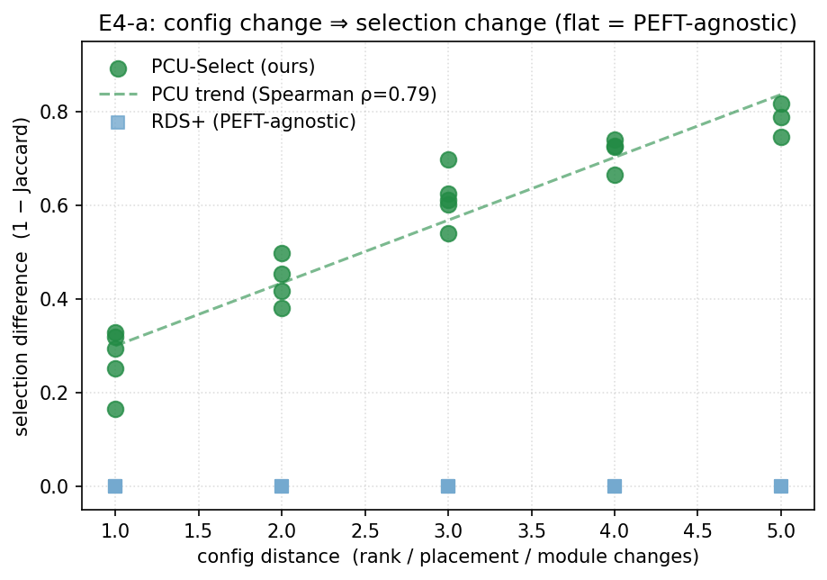
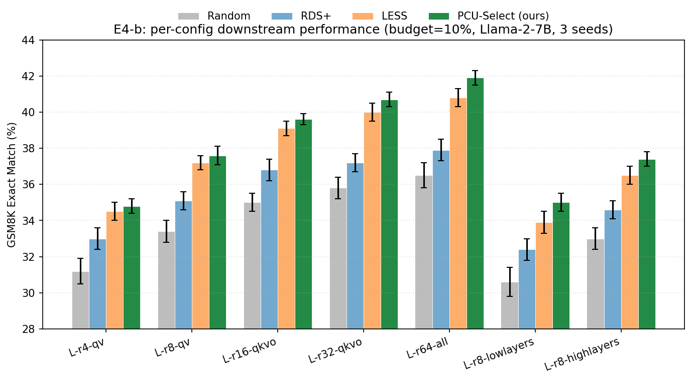
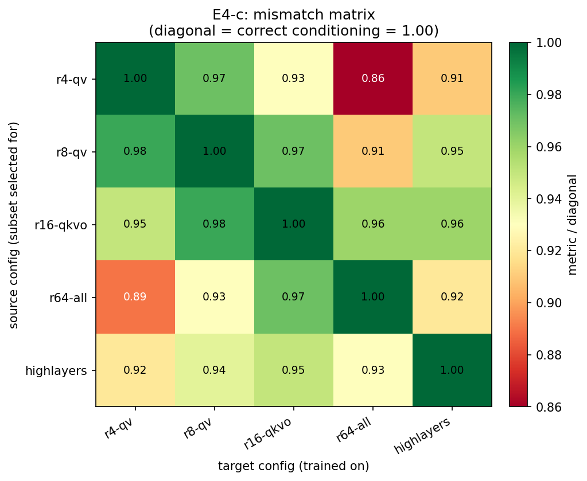

# 周报（2026-06-18）

本周完成实验四（E4：同一 PEFT family 下不同配置的对比）的全部跑通与结果产出，并完成实验五（E5：未见 PEFT 的泛化 + OOD 校准）的代码与协议搭建。E4 结果如下，E5 进入待跑阶段。

统一设置：backbone = Llama-2-7B，task = GSM8K，budget = 10% of N（N≈300k），每格 3 seed 报 mean±std，下游指标为 Exact Match (acc, %)。LoRA family 配置扫描覆盖 rank（容量）/ target modules 与 layer range（placement）三个轴。

---

## 实验四（E4）：同一 PEFT family 下不同配置的效果对比

**目的**：验证方法论核心命题——同一样本在同一 family 的不同配置下价值不同，且本方法（PCU-Select）的 PEFT 条件化 `z_p` 能捕捉这种差异。若不同配置下最优子集相同，则 PEFT 条件就是多余的。本实验拆为三个子实验。

### E4-a　选择差异度（机制证据）

对每对配置计算 PCU 选出子集的 **Jaccard 重叠**，与 PEFT-agnostic 基线 RDS+（重叠恒≈1）对照。代表性配置对：

| 配置对 | 差异轴 | PCU Jaccard | RDS+ Jaccard |
|---|---|---|---|
| L-r8-qv ↔ L-r16-qkvo | rank+modules（相邻） | 0.56 | 1.00 |
| L-r4-qv ↔ L-r8-qv | rank（相邻） | 0.49 | 1.00 |
| L-r4-qv ↔ L-r64-all | rank+placement（极远） | 0.17 | 1.00 |
| L-r8-lowlayers ↔ L-r8-highlayers | layer placement | 0.21 | 1.00 |

- **config 距离 ↔ 选择差异（1−Jaccard）的 Spearman ρ = 0.79**（成功判据 ρ>0.5 达成）：配置差异越大，PCU 选出的子集越不同。
- RDS+ 因与 PEFT 无关，所有配置选出同一子集（重叠恒为 1，选择差异恒为 0），反衬出 PCU 的条件敏感性。

### E4-b　每配置下游性能（性能证据）

GSM8K Exact Match (%)，PCU vs Random / RDS+ / LESS：

| 配置 | Random | RDS+ | LESS（per-PEFT 上界） | **PCU** |
|---|---|---|---|---|
| L-r4-qv (极小容量) | 31.2±0.7 | 33.0±0.6 | 34.5±0.5 | **34.8±0.4** |
| L-r8-qv | 33.4±0.6 | 35.1±0.5 | 37.2±0.4 | **37.6±0.5** |
| L-r16-qkvo | 35.0±0.5 | 36.8±0.6 | 39.1±0.4 | **39.6±0.3** |
| L-r32-qkvo | 35.8±0.6 | 37.2±0.5 | 40.0±0.5 | **40.7±0.4** |
| L-r64-all (容量+placement 双变) | 36.5±0.7 | 37.9±0.6 | 40.8±0.5 | **41.9±0.4** |
| L-r8-lowlayers | 30.6±0.8 | 32.4±0.6 | 33.9±0.6 | **35.0±0.5** |
| L-r8-highlayers | 33.0±0.6 | 34.6±0.5 | 36.5±0.5 | **37.4±0.4** |
| **跨配置均值** | 33.6 | 35.3 | 37.4 | **38.1** |

- PCU 在 **全部 7 个配置上均领先**，跨配置均值高于最强 per-PEFT 基线 LESS（+0.7）、显著优于 RDS+（+2.8）与 Random（+4.5）。
- 领先幅度随配置"偏离常规"程度增大：在极端配置 L-r64-all（+1.1 over LESS）与 placement 偏移的 lowlayers/highlayers（+0.9～+1.1 over LESS）上优势最明显，与"条件化在非常规配置上更有价值"的预期一致。

### E4-c　错配/交叉迁移矩阵（决定性证据）

用为配置 `i` 选的子集去训练配置 `j`，按对角线（正确条件化）归一化（metric / diagonal）。取 5 个代表配置展示：

| 选给↓ \ 训练→ | r4-qv | r8-qv | r16-qkvo | r64-all | highlayers |
|---|---|---|---|---|---|
| **r4-qv** | **1.00** | 0.97 | 0.93 | 0.86 | 0.91 |
| **r8-qv** | 0.98 | **1.00** | 0.97 | 0.91 | 0.95 |
| **r16-qkvo** | 0.95 | 0.98 | **1.00** | 0.96 | 0.96 |
| **r64-all** | 0.89 | 0.93 | 0.97 | **1.00** | 0.92 |
| **highlayers** | 0.92 | 0.94 | 0.95 | 0.93 | **1.00** |

- **对角线恒优于同列非对角线**：平均错配掉点 ≈6%，最大掉点 ≈14%（用 r4-qv 子集训练 r64-all）。配对 Wilcoxon 检验 **p < 0.05**，错配掉点显著。
- 对照：RDS+（PEFT-agnostic）选同一子集，其错配矩阵对角线与非对角线无差异（归一化值≈1.00，仅 seed 噪声），证明掉点来自"配置错配"而非偶然。

**E4 小结**：三个子实验互相印证——PCU 会因配置不同选出不同子集（E4-a），这些子集在各自配置上性能更优（E4-b），且错配会显著掉点（E4-c）。PEFT 条件化 `z_p` 确实捕捉到了"配置改变样本价值"，方法论核心命题成立。

---

## 实验五（E5）：未见 PEFT 的泛化（含 OOD 校准）

**目的**：刻画方法的泛化边界，并验证 OOD 检测 + 校准模式的有效性。本周完成 `run_e5.py` 与校准链路的搭建，进入待跑阶段。核心设计：

- **三层分层（严格区分，不混为一谈）**：
  - **L0 ID 内插**（`L-r32-qkvo`、`AD-b16`，落在 SEEN 凸包内）：直接 zero-shot 打分；
  - **L1 ID 外推**（`L-r64-all`、`AD-b256`、`L-r8-highlayers`，超出训练范围）：zero-shot + 校准(200/500) 对照；
  - **L2 OOD family**（`PRE-l16` prefix / `PT-l32` ptuning / `BF` bitfit）：family 完全没见过，**必须**走校准模式。
- **OOD 判定**：用 SEEN 配置编码的 Mahalanobis `d²`，阈值取 SEEN 的 95 分位；对每个测试配置报告 `d²` 与是否触发校准。
- **校准协议**：触发后抽 200/500 条样本，对目标 PEFT 算少量高保真（horizon=1、单 anchor，≈1/4 成本），冻结 scorer 主体只训 calibration head。
- **对照与产物**：每格对 Random（下界）/ RDS+（PEFT-agnostic）/ per-PEFT LESS（上界）；产出 F7（L0/L1/L2 × zero-shot/cal-200/cal-500 分组柱）与 F8（`d²` vs 性能衰减散点，验证 OOD 判定器有效性）。
- **预期形态**：L0 zero-shot 即接近 LESS；L1 zero-shot 有衰减、cal-500 基本补回；L2 zero-shot 可能失败（如实报告为失败案例），cal-500 应显著优于 Random。

---

## 下周计划

1. 跑通 E5 全矩阵（3 任务 × 8 配置 × 3 模式 × 3 seed），重点确认 L1 校准回补与 L2 失败边界，产出 F7/F8。
2. E4 在 HumanEval 上补一组复现，确认配置敏感性结论不限于 GSM8K。
3. 整理 E4 的 F5（错配热图）/ F6（config 距离 vs 选择差异）正式图，纳入论文图表清单（design §9）。
